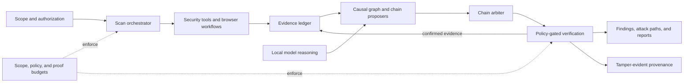

# Sentinel

### Evidence-driven security research that turns scanner output into testable attack hypotheses.

Most security tools stop at a list of alerts. Sentinel carries evidence across the
entire investigation: it records what each tool observed, builds a causal model of the
target, proposes multi-step attack paths, and selectively retests those hypotheses
before promoting them as verified results.

The system combines model-assisted reasoning with deterministic controls. Models can
help decide what deserves attention; they cannot bypass target scope, execution
policy, proof budgets, or the requirement to cite evidence. The result is a local
research environment designed to answer a harder question than “what fired?”:

> **What can an attacker actually do, what evidence supports it, and what should be
> tested next?**

Sentinel is built as a native macOS workstation backed by a Python analysis engine. It
includes a SwiftUI operations interface, authenticated local API, headless CLI,
security-tool orchestration, multi-persona browser workflows, causal graph analysis,
and report generation.

## Why Sentinel is different

### Evidence has a lifecycle

Raw tool output enters a content-addressed evidence store as an immutable observation.
Findings are separate objects with citations, confirmation levels, and lifecycle
states such as observed, promoted, suppressed, rejected, and invalidated. A model or
heuristic can propose a finding, but the ledger decides whether the proposal has the
evidence required to become part of the system’s working truth.

This makes uncertainty explicit. Sentinel can preserve the difference between “the
scanner reported it,” “the engine inferred it,” and “a controlled retest confirmed
it” instead of flattening all three into the same alert list.

### Attack chains are proposed, arbitrated, and verified

Sentinel uses two complementary chain engines:

- **Cortex** finds paths already present in the observed correlation graph.
- **NEXUS** works backward from attacker goals to synthesize plausible chains from
  typed security primitives, even when no graph edge has yet been observed.

The Chain Arbiter normalizes and merges both sources without confusing their
epistemic status. Hypothesized chains can enter a bounded hunt loop that retests their
steps through Wraith, folds confirmed primitives back into the graph, and searches
again for newly reachable goals. Unconfirmed hypotheses remain hypotheses; refuted
ones are removed.

That closed loop—**observe → hypothesize → verify → expand**—is the core of Sentinel’s
approach to autonomous security research.

### Multi-user logic is a first-class testing problem

The Persona Foundry turns authenticated testing into a repeatable workflow. It
provides research-persona storage, parameterized signup recipes, native and Playwright
drivers, account topology planning, and a challenge handoff bus for steps that must
remain human-controlled, such as CAPTCHA, email verification, or payment approval.

Every workflow begins with a time-bounded authorization envelope that defines the
operator, target origins, allowed workflows, constraints, and authorization basis.
Out-of-scope or expired work is rejected before browser execution reaches the wire.
This allows Sentinel to automate mechanical setup while keeping consequential
judgment and anti-bot challenges with the researcher.

### Autonomy has a receipt

Active proof is governed by scope checks, action classification, per-endpoint and
per-scan request budgets, owned-account rules, and program restrictions. Allowed and
denied actions are written to a content-addressed provenance chain that can be
exported as a scan capsule and verified for tampering.

The architectural rule is simple: **an AI component may raise suspicion, but it does
not lower the gate required to act.**

### It is an operating environment, not just a backend

The SwiftUI application is a native control surface for the same engine used by the
CLI. It streams scan events, renders findings and graph state, manages the backend,
hosts interactive research workflows, and connects browser-driven evidence back to
the active investigation. The backend remains independently usable through its
authenticated FastAPI interface.

## How the system reasons



The feedback edge matters: verification produces new evidence rather than simply
raising a confidence score. That evidence can change the graph, unlock a different
chain, or invalidate an earlier conclusion.

## Capabilities

| Area | Implementation |
| --- | --- |
| Evidence | Content-addressed observations, cited findings, lifecycle events, and WhyNot records |
| Reasoning | Knowledge graph correlation, Cortex/NEXUS chain ensemble, arbitration, verification, and bounded chain hunting |
| Execution | Tool registry, scan scheduler, strict scope registry, program restrictions, action policy, and proof budgets |
| Authenticated testing | Persona sessions, owned-identity proofs, differential authorization checks, signup recipes, browser replay, and human challenge handoff |
| Provenance | Merkle-linked policy-action records, redacted conduct summaries, and exportable scan capsules |
| Interfaces | FastAPI backend, event-streaming CLI, and native SwiftUI macOS application |
| Reporting | Evidence-backed findings, reproducible proof material, bounty-report composition, and submission-oriented rendering |

## Research systems

Sentinel’s named research systems divide the problem into distinct forms of security
reasoning:

- **CRONUS — Temporal Surface Mining:** compares a target across time to recover
  deprecated routes, historical endpoints, and security regressions that disappear
  from a conventional point-in-time scan.
- **MIMIC — Grey-Box Reconstruction:** recovers implied server behavior from public
  client artifacts such as JavaScript bundles, source maps, API schemas, and GraphQL
  operations.
- **NEXUS — Exploit Chain Synthesis:** reasons across individually modest primitives
  to identify paths toward attacker goals, then send those paths through the
  verification loop.
- **Persona Foundry — Authorized Identity Orchestration:** makes multi-account testing
  reproducible without bypassing human-verification controls or turning identity
  creation into an unaccountable background action.
- **Causal Replay:** forks a recorded state, changes an input, and identifies which
  downstream conclusions still hold through the Merkle-DAG replay substrate.

The ambition is not to produce more findings. It is to build a security system whose
reasoning can be inspected, challenged, replayed, and improved.

## Architecture

| Component | Role |
| --- | --- |
| `core/server/` | Authenticated FastAPI surface, realtime events, and workflow routes |
| `core/engine/` and `core/scheduler/` | Scan lifecycle, task selection, and tool coordination |
| `core/epistemic/` and `core/data/` | Evidence ledger, persistence, findings, issues, and graph state |
| `core/cortex/` and `core/omega/` | Correlation, causal reasoning, chain synthesis, arbitration, and verification |
| `core/wraith/` | Active proof, authentication differentials, BOLA/IDOR workflows, and verification |
| `core/ghost/` and `core/foundry/` | Browser capture, replayable workflows, personas, and human challenge handoff |
| `core/safety/` and `core/replay/` | Proof budgets, conduct provenance, content-addressed blocks, and capsules |
| `ui/` | Native SwiftUI/Metal macOS application |
| `pysentinel.py` | Authenticated headless client and event stream |

The default deployment is intentionally local: the API binds to `127.0.0.1:8765`,
requires authentication, and stores its token at `~/.sentinelforge/api_token` with
mode `0600`.

## Quick start

Requirements: Python 3.11+, Ollama for local model-assisted analysis, and whichever
external security tools the selected scan modules require. The native app requires
macOS 14+ and Xcode 15+.

```bash
git clone https://github.com/Jbase16/sentinel.git
cd sentinel
python3 -m venv .venv
source .venv/bin/activate
python3 -m pip install -r requirements.txt
```

Start the backend:

```bash
python3 -m uvicorn core.server.api:app --host 127.0.0.1 --port 8765
```

Start a scan from the CLI:

```bash
python3 pysentinel.py \
  --target https://target.example \
  --mode standard
```

Open `ui/SentinelForge.xcodeproj` in Xcode to run the native application. See the
[startup troubleshooting guide](docs/STARTUP_TROUBLESHOOTING.md) for backend and
local-service diagnostics.

## Development

```bash
source .venv/bin/activate
python3 -m pip install -e '.[dev]'
python3 -m pytest tests
make check-schemas
```

The repository contains unit, integration, security, verification, calibration, and
native UI coverage.

Additional documentation:

- [Chain Arbiter](docs/CHAIN_ARBITER.md)
- [Persona Foundry](docs/PHASE_7_PERSONA_FOUNDRY.md)
- [Authentication](docs/AUTHENTICATION.md)
- [Development guide](docs/DEVELOPMENT_GUIDE.md)

## Responsible use

Sentinel is for authorized security research. Its scope, policy, and provenance
controls keep that research deliberate and accountable.
