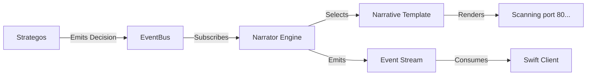

# Layer 3: The Narrator Engine (Overview)

**Goal:** Transform the system's internal decision-making process into a human-readable narrative stream. This layer sits between the "Brain" (Strategos) and the "Face" (UI), ensuring the user always understands *why* the system is doing what it's doing.

## Architecture
Layer 3 uses an event-driven observer pattern. It does not influence decisions; it only explains them.

## Key Components & Files

### 1. The Engine (`core/cortex/narrator.py`)
-   **Role:** The central processor. Subscribes to `DECISION_MADE` events.
-   **Logic:**
    -   Receives a `DecisionPoint`.
    -   Selects the appropriate `NarrativeTemplate` based on the decision type (Intent, Tool, Phase).
    -   Renders the text.
    -   Emits a `NARRATIVE_EMITTED` event.

### 2. The Templates (`core/cortex/narrative_templates.py`) 
-   **Role:** Strategy pattern for converting data to text.
-   **Key Classes:**
    -   `ToolSelectionTemplate`: "Deploying Nmap against target..."
    -   `ToolRejectionTemplate`: "Blocked 3 tools by Mode Overlay."
    -   `IntentTemplate`: "Shifting intent to Vulnerability Scanning."
    -   `PhaseTemplate`: "entering Phase 3..."
-   **Benefit:** Allows changing the "Voice" of the AI without touching the engine logic.

### 3. The Data Structure (`core/scheduler/decisions.py`)
-   **Role:** Defines the `DecisionPoint` object that carries the context.
-   **Integration:** The `DecisionContext` in Strategos automatically routes decisions to the Narrator (if enabled).

### 4. The UI Interface (Swift)
-   **`ui/Sources/Services/EventStreamClient.swift`**: Listens for the `narrative_emitted` event type.
-   **`ui/Sources/Models/HelixAppState.swift`**: Renders these events in the live log, typically prefixed with `🧠` to distinguish them from raw logs.

## Why This Matters
Before Layer 3, the user only saw "Tool Started" or "Tool Failed".
**After Layer 3**, the user sees:
> "🧠 Analysis complete. Shifting intent to Active Scanning. Deploying 3 tools [nmap, httpx, nuclei] while holding back [masscan] due to Risk Policy."

This transparency builds trust in the autonomous system.
