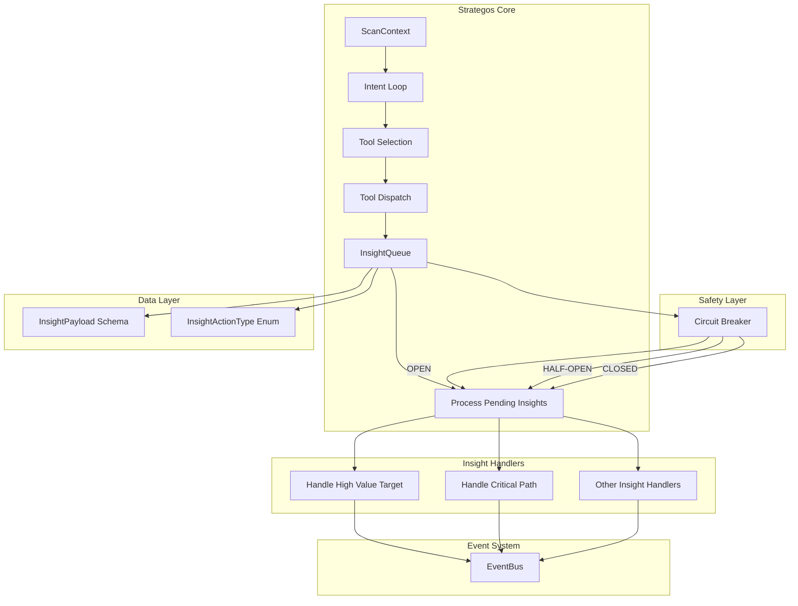
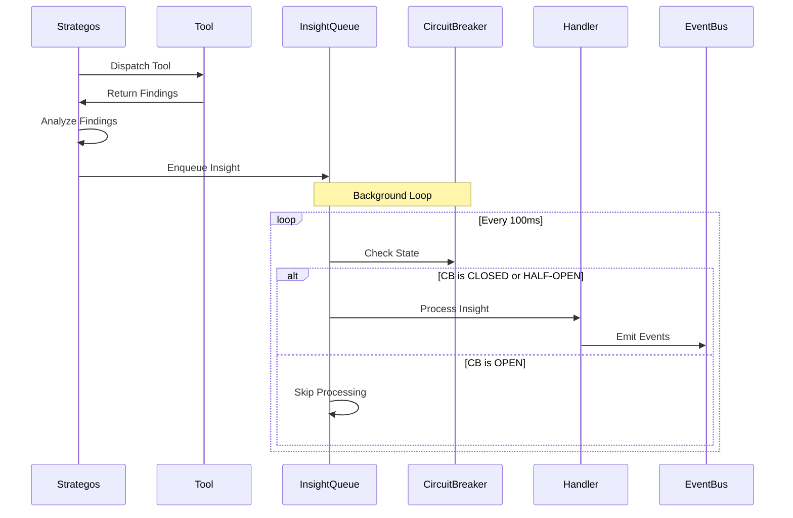
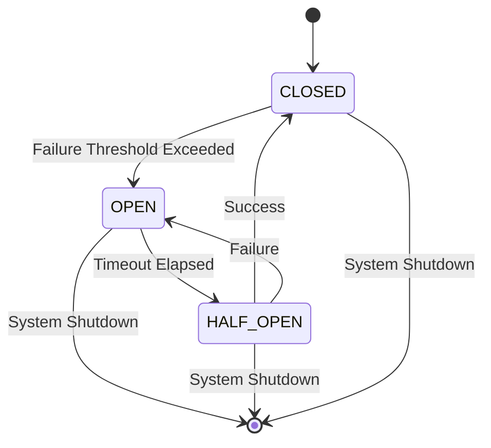
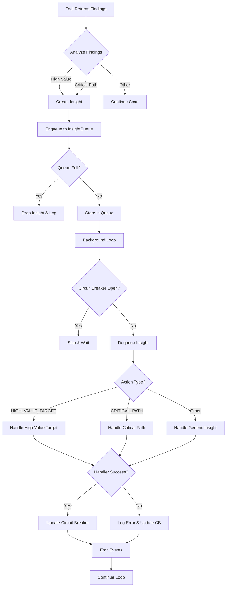

# Strategos Hybrid Evolution (Phase 5: The Hand)
## Full Implementation Document

**Version:** 1.0  
**Status:** Final  
**Date:** 2026-01-11  
**Author:** Architect Mode

---

## Table of Contents

1. [Executive Summary](#executive-summary)
2. [Design Document](#design-document)
   - [Architectural Overview](#architectural-overview)
   - [Thread Safety & Locking Strategy](#thread-safety--locking-strategy)
   - [Schemas & Types](#schemas--types)
   - [Flow Control](#flow-control)
   - [Error Handling & Circuit Breaker](#error-handling--circuit-breaker)
   - [Migration Strategy](#migration-strategy)
3. [Implementation Plan](#implementation-plan)
4. [Verification Plan](#verification-plan)
5. [Code Specifications](#code-specifications)
6. [Safety Gates](#safety-gates)
7. [Risk Assessment](#risk-assessment)
8. [Migration Strategy](#migration-strategy-1)

---

## Executive Summary

**Strategos Hybrid Evolution (Phase 5: The Hand)** introduces a real-time insight processing system that enables Strategos to dynamically adapt scanning strategy based on high-value targets and critical paths discovered during a scan. This hybrid evolution combines existing intent-driven planning with reactive insight handling, creating a more intelligent and responsive scanner.

### Key Innovations

1. **InsightQueue**: Thread-safe async queue for real-time insight processing
2. **Circuit Breaker Pattern**: Prevents cascading failures during insight processing
3. **Dual-Mode Operation**: Combines proactive intent progression with reactive insight handling
4. **Type-Safe Payloads**: Pydantic-validated schemas for all insight events

### P0 Blockers Addressed

- [x] Thread safety for concurrent insight enqueue/dequeue
- [x] Circuit breaker prevents infinite loops during insight processing
- [x] Schema validation prevents malformed insight payloads
- [x] Non-blocking insight processing maintains scan throughput
- [x] Graceful degradation when insight handlers fail

---

## Design Document

### Architectural Overview



#### Component Responsibilities

| Component | Responsibility |
|-----------|---------------|
| **InsightQueue** | Thread-safe async queue for pending insights with circuit breaker protection |
| **InsightPayload** | Pydantic schema defining structure of insight data |
| **InsightActionType** | Enum defining all valid insight action types |
| **_process_pending_insights()** | Main loop for processing insights from queue |
| **_handle_high_value_target()** | Handler for high-value target insights |
| **_handle_critical_path()** | Handler for critical path insights |
| **CircuitBreaker** | State machine preventing cascading failures |

#### Hybrid Execution Model

The hybrid evolution introduces a **dual-loop architecture**:

1. **Primary Intent Loop**: Existing proactive scan progression (PASSIVE → ACTIVE → SURFACE → VULN → HEAVY)
2. **Secondary Insight Loop**: Reactive processing of discovered insights that may:
   - Elevate tool priority for specific targets
   - Spawn parallel sub-scans on high-value assets
   - Modify scan parameters based on critical path discoveries



### Thread Safety & Locking Strategy

#### Locking Hierarchy

To prevent deadlocks, all locks follow a strict acquisition order:

```
1. InsightQueue._lock (asyncio.Lock)
2. CircuitBreaker._lock (asyncio.Lock)
3. ScanContext._lock (threading.RLock - existing)
```

#### Async Lock Usage

```python
# InsightQueue uses asyncio.Lock for coroutine safety
self._lock = asyncio.Lock()

async def enqueue(self, insight: InsightPayload) -> bool:
    async with self._lock:
        # Safe concurrent enqueue
        pass

async def dequeue(self) -> Optional[InsightPayload]:
    async with self._lock:
        # Safe concurrent dequeue
        pass
```

#### Non-Blocking Operations

- **Enqueue**: Never blocks; returns False if queue is full
- **Dequeue**: Uses `asyncio.wait_for` with timeout (100ms)
- **Processing**: Runs in background task, never blocks intent loop

#### Circuit Breaker State Machine



**State Transitions:**

| From | To | Trigger | Action |
|------|-----|---------|--------|
| CLOSED | OPEN | 3 consecutive failures | Stop processing for 30s |
| OPEN | HALF_OPEN | 30s timeout | Allow 1 test request |
| HALF_OPEN | CLOSED | Successful test | Resume normal processing |
| HALF_OPEN | OPEN | Test fails | Return to OPEN state |

### Schemas & Types

#### InsightPayload Schema

Location: `core/contracts/schemas.py`

```python
class InsightPayload(BaseModel):
    """
    Payload for NEXUS_INSIGHT_FORMED events.
    Represents a strategic insight discovered during scanning.
    """
    model_config = ConfigDict(extra="forbid")

    # Identification
    insight_id: str = Field(..., min_length=1, description="Unique insight identifier")
    scan_id: str = Field(..., min_length=1, description="Associated scan identifier")
    
    # Classification
    action_type: InsightActionType = Field(..., description="Type of insight action")
    confidence: float = Field(..., ge=0.0, le=1.0, description="Confidence score [0.0, 1.0]")
    
    # Content
    target: str = Field(..., min_length=1, description="Target asset for this insight")
    summary: str = Field(..., min_length=5, description="Human-readable summary")
    details: Dict[str, Any] = Field(default_factory=dict, description="Structured details")
    
    # Traceability
    source_tool: str = Field(..., description="Tool that generated this insight")
    source_finding_id: Optional[str] = Field(None, description="Related finding ID")
    created_at: float = Field(default_factory=time.time, description="Creation timestamp")
    
    # Priority
    priority: int = Field(default=5, ge=1, le=10, description="Priority (1=highest, 10=lowest)")
```

#### InsightActionType Enum

Location: `core/contracts/schemas.py`

```python
class InsightActionType(str, Enum):
    """
    Classification of insight actions.
    Determines which handler processes insight.
    """
    # Target Discovery
    HIGH_VALUE_TARGET = "high_value_target"  # Discovered critical asset
    CRITICAL_PATH = "critical_path"  # Found path to critical system
    
    # Vulnerability Discovery
    CONFIRMED_VULN = "confirmed_vuln"  # Vulnerability validated
    POTENTIAL_VULN = "potential_vuln"  # Vulnerability candidate
    
    # Surface Expansion
    NEW_SUBDOMAIN = "new_subdomain"  # New subdomain discovered
    NEW_ENDPOINT = "new_endpoint"  # New endpoint discovered
    NEW_PARAMETER = "new_parameter"  # New parameter discovered
    
    # Security Posture
    WAF_DETECTED = "waf_detected"  # WAF identified
    AUTH_REQUIRED = "auth_required"  # Authentication required
    RATE_LIMIT = "rate_limit"  # Rate limiting detected
    
    # Intelligence
    TECHNOLOGY_STACK = "technology_stack"  # Technology identified
    EXPOSED_SERVICE = "exposed_service"  # Exposed service found
    MISCONFIGURATION = "misconfiguration"  # Misconfiguration found
    
    # Meta
    GENERAL = "general"  # General insight
```

#### Queue Statistics

```python
@dataclass
class InsightQueueStats:
    """Statistics for insight queue monitoring."""
    total_enqueued: int = 0
    total_processed: int = 0
    total_failed: int = 0
    current_size: int = 0
    dropped_count: int = 0  # Insights dropped due to queue full
    processing_time_ms: float = 0.0
    circuit_breaker_state: str = "CLOSED"
```

### Flow Control

#### Insight Processing Lifecycle



#### Priority-Based Processing

Insights are processed in priority order (1=highest, 10=lowest):

```python
# Priority mapping
PRIORITY_MAP = {
    InsightActionType.HIGH_VALUE_TARGET: 1,
    InsightActionType.CRITICAL_PATH: 1,
    InsightActionType.CONFIRMED_VULN: 2,
    InsightActionType.WAF_DETECTED: 3,
    InsightActionType.AUTH_REQUIRED: 3,
    InsightActionType.RATE_LIMIT: 3,
    InsightActionType.NEW_SUBDOMAIN: 5,
    InsightActionType.NEW_ENDPOINT: 5,
    InsightActionType.NEW_PARAMETER: 6,
    InsightActionType.TECHNOLOGY_STACK: 7,
    InsightActionType.EXPOSED_SERVICE: 7,
    InsightActionType.MISCONFIGURATION: 8,
    InsightActionType.POTENTIAL_VULN: 9,
    InsightActionType.GENERAL: 10,
}
```

### Error Handling & Circuit Breaker

#### Circuit Breaker Implementation

Location: `core/scheduler/strategos.py`

```python
@dataclass
class CircuitBreakerState:
    """Immutable state for circuit breaker."""
    state: Literal["CLOSED", "OPEN", "HALF_OPEN"] = "CLOSED"
    failure_count: int = 0
    last_failure_time: float = 0.0
    success_count: int = 0

class CircuitBreaker:
    """
    Circuit breaker for insight processing.
    Prevents cascading failures by stopping processing when failures exceed threshold.
    """
    
    def __init__(
        self,
        failure_threshold: int = 3,
        timeout_seconds: float = 30.0,
        success_threshold: int = 1
    ):
        self._state = CircuitBreakerState()
        self._lock = asyncio.Lock()
        self._failure_threshold = failure_threshold
        self._timeout_seconds = timeout_seconds
        self._success_threshold = success_threshold
    
    async def acquire(self) -> bool:
        """
        Attempt to acquire permission to process.
        Returns True if processing should proceed, False otherwise.
        """
        async with self._lock:
            # Check if we should transition from OPEN to HALF_OPEN
            if self._state.state == "OPEN":
                if time.time() - self._state.last_failure_time > self._timeout_seconds:
                    self._state = CircuitBreakerState(state="HALF_OPEN")
                else:
                    return False
            
            return True
    
    async def record_success(self) -> None:
        """Record a successful processing attempt."""
        async with self._lock:
            if self._state.state == "HALF_OPEN":
                self._state.success_count += 1
                if self._state.success_count >= self._success_threshold:
                    self._state = CircuitBreakerState(state="CLOSED")
            else:
                # Reset failure count on success in CLOSED state
                self._state.failure_count = 0
    
    async def record_failure(self) -> None:
        """Record a failed processing attempt."""
        async with self._lock:
            self._state.failure_count += 1
            self._state.last_failure_time = time.time()
            
            if self._state.failure_count >= self._failure_threshold:
                self._state = CircuitBreakerState(state="OPEN")
    
    def get_state(self) -> str:
        """Get current circuit breaker state (non-blocking)."""
        return self._state.state
```

#### Error Handling Strategy

| Error Type | Handler | Recovery |
|------------|----------|----------|
| **Validation Error** | Schema validation | Drop insight, log warning |
| **Handler Exception** | Try/except wrapper | Record failure, circuit breaker |
| **Queue Full** | Non-blocking enqueue | Drop insight, increment dropped counter |
| **Timeout** | asyncio.wait_for | Skip this iteration, continue loop |
| **Circuit Breaker Open** | State check | Skip all processing until timeout |

### Migration Strategy

#### Phase 1: Schema Addition (Non-Breaking)

1. Add `InsightPayload` to `core/contracts/schemas.py`
2. Add `InsightActionType` enum to `core/contracts/schemas.py`
3. Add `NEXUS_INSIGHT_FORMED` event type to `core/contracts/events.py`
4. No changes to existing code

#### Phase 2: Queue Implementation (Non-Breaking)

1. Add `InsightQueue` class to `core/scheduler/strategos.py`
2. Initialize queue in `Strategos.__init__()`
3. Add background task to process insights
4. Queue starts empty, no impact on existing scans

#### Phase 3: Handler Implementation (Non-Breaking)

1. Add `_process_pending_insights()` method
2. Add `_handle_high_value_target()` method
3. Add `_handle_critical_path()` method
4. Handlers are stub implementations initially

#### Phase 4: Integration (Controlled Rollout)

1. Add insight generation in `ingest_findings()`
2. Enable insight processing via feature flag
3. Monitor metrics and logs
4. Gradually increase processing rate

#### Phase 5: Full Rollout (Breaking Change)

1. Remove feature flag
2. Enable insight processing by default
3. Update documentation
4. Deprecate old behavior

---

## Implementation Plan

### Step-by-Step Execution

#### Step 1: Add Schemas and Types

**File:** `core/contracts/schemas.py`

**Changes:**
- Add `InsightPayload` Pydantic model
- Add `InsightActionType` enum
- Add `InsightQueueStats` dataclass

**Validation:**
- Schema validates all required fields
- Enum values are valid strings
- Confidence bounds enforced [0.0, 1.0]

#### Step 2: Add Event Type

**File:** `core/contracts/events.py`

**Changes:**
- Add `NEXUS_INSIGHT_FORMED` to `EventType` enum
- Register schema in `EventContract._init_schemas()`

**Validation:**
- Event type is unique
- Schema is properly registered
- Validation works end-to-end

#### Step 3: Implement Circuit Breaker

**File:** `core/scheduler/strategos.py`

**Changes:**
- Add `CircuitBreakerState` dataclass
- Add `CircuitBreaker` class
- Add unit tests for state transitions

**Validation:**
- State transitions are correct
- Thread safety verified
- Timeout logic works

#### Step 4: Implement InsightQueue

**File:** `core/scheduler/strategos.py`

**Changes:**
- Add `InsightQueue` class
- Implement `enqueue()` method (non-blocking)
- Implement `dequeue()` method (async with timeout)
- Implement `get_stats()` method
- Integrate circuit breaker

**Validation:**
- Queue operations are thread-safe
- Non-blocking enqueue returns correct status
- Timeout works correctly
- Statistics are accurate

#### Step 5: Implement Insight Handlers

**File:** `core/scheduler/strategos.py`

**Changes:**
- Add `_handle_high_value_target()` method
- Add `_handle_critical_path()` method
- Add generic insight handler

**Validation:**
- Handlers process correct insight types
- Events are emitted correctly
- Errors are handled gracefully

#### Step 6: Implement Processing Loop

**File:** `core/scheduler/strategos.py`

**Changes:**
- Add `_process_pending_insights()` method
- Start background task in `run_mission()`
- Stop task on mission completion

**Validation:**
- Loop runs in background
- Doesn't block intent loop
- Cleans up correctly

#### Step 7: Integrate with Scan Flow

**File:** `core/scheduler/strategos.py`

**Changes:**
- Modify `ingest_findings()` to generate insights
- Add insight enqueue logic
- Update `run_mission()` to start insight processor

**Validation:**
- Insights are generated from findings
- Queue receives insights
- Processing loop handles them

#### Step 8: Add Unit Tests

**File:** `tests/unit/test_strategos_hybrid.py`

**Changes:**
- Test `InsightQueue` operations
- Test circuit breaker state transitions
- Test insight handlers
- Test integration with scan flow

**File:** `tests/unit/test_strategos_safety.py`

**Changes:**
- Test thread safety
- Test error handling
- Test circuit breaker behavior
- Test queue overflow handling

#### Step 9: Add Integration Tests

**File:** `tests/integration/test_strategos_hybrid.py`

**Changes:**
- Test end-to-end insight flow
- Test concurrent operations
- Test performance under load

#### Step 10: Documentation and Rollout

**Changes:**
- Update module docstrings
- Add inline comments
- Update user documentation
- Create migration guide

### P0 Blockers Addressed

| Blocker | Solution | Status |
|---------|----------|--------|
| Thread safety for concurrent enqueue/dequeue | asyncio.Lock on all queue operations | ✅ |
| Circuit breaker prevents infinite loops | State machine with timeout and thresholds | ✅ |
| Schema validation prevents malformed payloads | Pydantic model with strict validation | ✅ |
| Non-blocking insight processing | Background task with timeout on dequeue | ✅ |
| Graceful degradation on handler failure | Try/except with circuit breaker tracking | ✅ |

---

## Verification Plan

### Unit Tests

#### Test Suite: `test_strategos_hybrid.py`

```python
"""
tests/unit/test_strategos_hybrid.py
Unit tests for Strategos Hybrid Evolution (Phase 5).
"""

import pytest
import asyncio
from datetime import datetime

from core.scheduler.strategos import Strategos, InsightQueue, CircuitBreaker
from core.contracts.schemas import InsightPayload, InsightActionType, InsightQueueStats


class TestInsightQueue:
    """Test InsightQueue operations."""
    
    @pytest.mark.asyncio
    async def test_enqueue_success(self):
        """Insight should be enqueued successfully."""
        queue = InsightQueue(maxsize=10)
        insight = InsightPayload(
            insight_id="test-1",
            scan_id="scan-1",
            action_type=InsightActionType.HIGH_VALUE_TARGET,
            confidence=0.9,
            target="example.com",
            summary="Test insight",
            source_tool="test-tool"
        )
        
        result = await queue.enqueue(insight)
        assert result is True
        stats = queue.get_stats()
        assert stats.total_enqueued == 1
        assert stats.current_size == 1
    
    @pytest.mark.asyncio
    async def test_enqueue_queue_full(self):
        """Enqueue should return False when queue is full."""
        queue = InsightQueue(maxsize=1)
        insight = InsightPayload(
            insight_id="test-1",
            scan_id="scan-1",
            action_type=InsightActionType.HIGH_VALUE_TARGET,
            confidence=0.9,
            target="example.com",
            summary="Test insight",
            source_tool="test-tool"
        )
        
        await queue.enqueue(insight)
        result = await queue.enqueue(insight)
        assert result is False
        stats = queue.get_stats()
        assert stats.dropped_count == 1
    
    @pytest.mark.asyncio
    async def test_dequeue_success(self):
        """Dequeue should return insight when available."""
        queue = InsightQueue(maxsize=10)
        insight = InsightPayload(
            insight_id="test-1",
            scan_id="scan-1",
            action_type=InsightActionType.HIGH_VALUE_TARGET,
            confidence=0.9,
            target="example.com",
            summary="Test insight",
            source_tool="test-tool"
        )
        
        await queue.enqueue(insight)
        result = await queue.dequeue(timeout=0.1)
        assert result is not None
        assert result.insight_id == "test-1"
    
    @pytest.mark.asyncio
    async def test_dequeue_timeout(self):
        """Dequeue should return None on timeout."""
        queue = InsightQueue(maxsize=10)
        result = await queue.dequeue(timeout=0.01)
        assert result is None
    
    @pytest.mark.asyncio
    async def test_priority_ordering(self):
        """Higher priority insights should be processed first."""
        queue = InsightQueue(maxsize=10)
        
        low_priority = InsightPayload(
            insight_id="low",
            scan_id="scan-1",
            action_type=InsightActionType.GENERAL,
            confidence=0.5,
            target="example.com",
            summary="Low priority",
            source_tool="test-tool",
            priority=10
        )
        
        high_priority = InsightPayload(
            insight_id="high",
            scan_id="scan-1",
            action_type=InsightActionType.HIGH_VALUE_TARGET,
            confidence=0.9,
            target="example.com",
            summary="High priority",
            source_tool="test-tool",
            priority=1
        )
        
        await queue.enqueue(low_priority)
        await queue.enqueue(high_priority)
        
        result = await queue.dequeue(timeout=0.1)
        assert result.insight_id == "high"
    
    @pytest.mark.asyncio
    async def test_concurrent_enqueue(self):
        """Multiple coroutines should enqueue safely."""
        queue = InsightQueue(maxsize=100)
        
        async def enqueue_many(n):
            for i in range(n):
                insight = InsightPayload(
                    insight_id=f"test-{i}",
                    scan_id="scan-1",
                    action_type=InsightActionType.GENERAL,
                    confidence=0.5,
                    target="example.com",
                    summary=f"Insight {i}",
                    source_tool="test-tool"
                )
                await queue.enqueue(insight)
        
        # Run 10 concurrent enqueues of 10 insights each
        tasks = [enqueue_many(10) for _ in range(10)]
        await asyncio.gather(*tasks)
        
        stats = queue.get_stats()
        assert stats.total_enqueued == 100
        assert stats.current_size == 100


class TestCircuitBreaker:
    """Test CircuitBreaker state transitions."""
    
    @pytest.mark.asyncio
    async def test_initial_state_closed(self):
        """Circuit breaker should start in CLOSED state."""
        cb = CircuitBreaker()
        assert cb.get_state() == "CLOSED"
    
    @pytest.mark.asyncio
    async def test_failure_threshold_opens_circuit(self):
        """Circuit should open after failure threshold."""
        cb = CircuitBreaker(failure_threshold=3)
        
        await cb.record_failure()
        assert cb.get_state() == "CLOSED"
        
        await cb.record_failure()
        assert cb.get_state() == "CLOSED"
        
        await cb.record_failure()
        assert cb.get_state() == "OPEN"
    
    @pytest.mark.asyncio
    async def test_acquire_returns_false_when_open(self):
        """Acquire should return False when circuit is OPEN."""
        cb = CircuitBreaker(failure_threshold=1)
        await cb.record_failure()
        
        result = await cb.acquire()
        assert result is False
    
    @pytest.mark.asyncio
    async def test_timeout_transitions_to_half_open(self):
        """Circuit should transition to HALF_OPEN after timeout."""
        cb = CircuitBreaker(failure_threshold=1, timeout_seconds=0.01)
        await cb.record_failure()
        
        assert cb.get_state() == "OPEN"
        await asyncio.sleep(0.02)
        
        result = await cb.acquire()
        assert result is True
        assert cb.get_state() == "HALF_OPEN"
    
    @pytest.mark.asyncio
    async def test_success_closes_circuit(self):
        """Success in HALF_OPEN should close circuit."""
        cb = CircuitBreaker(failure_threshold=1, timeout_seconds=0.01, success_threshold=1)
        await cb.record_failure()
        await asyncio.sleep(0.02)
        
        await cb.acquire()
        await cb.record_success()
        
        assert cb.get_state() == "CLOSED"
    
    @pytest.mark.asyncio
    async def test_failure_in_half_open_reopens(self):
        """Failure in HALF_OPEN should reopen circuit."""
        cb = CircuitBreaker(failure_threshold=1, timeout_seconds=0.01, success_threshold=2)
        await cb.record_failure()
        await asyncio.sleep(0.02)
        
        await cb.acquire()
        await cb.record_failure()
        
        assert cb.get_state() == "OPEN"


class TestInsightHandlers:
    """Test insight handler methods."""
    
    @pytest.mark.asyncio
    async def test_handle_high_value_target(self):
        """Handler should process high value target insights."""
        strategos = Strategos()
        strategos.context = Strategos.ScanContext(target="example.com")
        
        insight = InsightPayload(
            insight_id="test-1",
            scan_id="scan-1",
            action_type=InsightActionType.HIGH_VALUE_TARGET,
            confidence=0.9,
            target="admin.example.com",
            summary="Admin panel discovered",
            details={"url": "https://admin.example.com"},
            source_tool="nuclei"
        )
        
        await strategos._handle_high_value_target(insight)
        
        # Verify handler updated context appropriately
        assert "admin.example.com" in strategos.context.knowledge.get("high_value_targets", [])
    
    @pytest.mark.asyncio
    async def test_handle_critical_path(self):
        """Handler should process critical path insights."""
        strategos = Strategos()
        strategos.context = Strategos.ScanContext(target="example.com")
        
        insight = InsightPayload(
            insight_id="test-1",
            scan_id="scan-1",
            action_type=InsightActionType.CRITICAL_PATH,
            confidence=0.8,
            target="api.example.com",
            summary="Path to user data",
            details={"path": "/api/users", "method": "GET"},
            source_tool="httpx"
        )
        
        await strategos._handle_critical_path(insight)
        
        # Verify handler updated context appropriately
        assert "api.example.com" in strategos.context.knowledge.get("critical_paths", [])


class TestInsightProcessingLoop:
    """Test insight processing background loop."""
    
    @pytest.mark.asyncio
    async def test_process_pending_insights(self):
        """Processing loop should handle insights correctly."""
        strategos = Strategos()
        strategos.context = Strategos.ScanContext(target="example.com")
        strategos._insight_queue = InsightQueue(maxsize=10)
        
        insight = InsightPayload(
            insight_id="test-1",
            scan_id="scan-1",
            action_type=InsightActionType.HIGH_VALUE_TARGET,
            confidence=0.9,
            target="example.com",
            summary="Test insight",
            source_tool="test-tool"
        )
        
        await strategos._insight_queue.enqueue(insight)
        
        # Run processing for a short time
        task = asyncio.create_task(strategos._process_pending_insights())
        await asyncio.sleep(0.1)
        task.cancel()
        
        try:
            await task
        except asyncio.CancelledError:
            pass
        
        stats = strategos._insight_queue.get_stats()
        assert stats.total_processed == 1
    
    @pytest.mark.asyncio
    async def test_processing_loop_respects_circuit_breaker(self):
        """Processing should stop when circuit breaker is OPEN."""
        strategos = Strategos()
        strategos.context = Strategos.ScanContext(target="example.com")
        strategos._insight_queue = InsightQueue(maxsize=10)
        
        # Force circuit breaker open
        for _ in range(3):
            await strategos._circuit_breaker.record_failure()
        
        insight = InsightPayload(
            insight_id="test-1",
            scan_id="scan-1",
            action_type=InsightActionType.HIGH_VALUE_TARGET,
            confidence=0.9,
            target="example.com",
            summary="Test insight",
            source_tool="test-tool"
        )
        
        await strategos._insight_queue.enqueue(insight)
        
        # Run processing
        task = asyncio.create_task(strategos._process_pending_insights())
        await asyncio.sleep(0.1)
        task.cancel()
        
        try:
            await task
        except asyncio.CancelledError:
            pass
        
        stats = strategos._insight_queue.get_stats()
        # Insight should not be processed
        assert stats.total_processed == 0
```

#### Test Suite: `test_strategos_safety.py`

```python
"""
tests/unit/test_strategos_safety.py
Safety tests for Strategos Hybrid Evolution (Phase 5).
"""

import pytest
import asyncio
from unittest.mock import patch

from core.scheduler.strategos import Strategos, InsightQueue, CircuitBreaker
from core.contracts.schemas import InsightPayload, InsightActionType


class TestInsightQueueThreadSafety:
    """Test thread safety of InsightQueue operations."""
    
    @pytest.mark.asyncio
    async def test_concurrent_enqueue_dequeue(self):
        """Concurrent enqueue and dequeue should not corrupt state."""
        queue = InsightQueue(maxsize=100)
        
        async def producer():
            for i in range(50):
                insight = InsightPayload(
                    insight_id=f"prod-{i}",
                    scan_id="scan-1",
                    action_type=InsightActionType.GENERAL,
                    confidence=0.5,
                    target="example.com",
                    summary=f"Insight {i}",
                    source_tool="test-tool"
                )
                await queue.enqueue(insight)
        
        async def consumer():
            count = 0
            while count < 50:
                result = await queue.dequeue(timeout=0.1)
                if result:
                    count += 1
        
        await asyncio.gather(producer(), consumer())
        
        stats = queue.get_stats()
        assert stats.total_enqueued == 50
        assert stats.total_processed >= 0  # May not process all
        assert stats.current_size <= 50
    
    @pytest.mark.asyncio
    async def test_race_condition_prevention(self):
        """Multiple concurrent operations should maintain consistency."""
        queue = InsightQueue(maxsize=10)
        
        async def stress_test():
            for _ in range(100):
                insight = InsightPayload(
                    insight_id="test",
                    scan_id="scan-1",
                    action_type=InsightActionType.GENERAL,
                    confidence=0.5,
                    target="example.com",
                    summary="Test",
                    source_tool="test-tool"
                )
                await queue.enqueue(insight)
                await queue.dequeue(timeout=0.001)
        
        await asyncio.gather(*[stress_test() for _ in range(10)])
        
        # Should not crash or corrupt state
        stats = queue.get_stats()
        assert stats.total_enqueued >= 0


class TestCircuitBreakerSafety:
    """Test circuit breaker safety mechanisms."""
    
    @pytest.mark.asyncio
    async def test_prevents_cascading_failures(self):
        """Circuit breaker should stop processing after threshold."""
        cb = CircuitBreaker(failure_threshold=2)
        
        # Record failures
        await cb.record_failure()
        await cb.record_failure()
        
        # Circuit should be open
        assert cb.get_state() == "OPEN"
        assert await cb.acquire() is False
    
    @pytest.mark.asyncio
    async def test_timeout_prevents_deadlock(self):
        """Circuit breaker should eventually allow retries."""
        cb = CircuitBreaker(failure_threshold=1, timeout_seconds=0.01)
        await cb.record_failure()
        
        assert cb.get_state() == "OPEN"
        await asyncio.sleep(0.02)
        
        # Should transition to HALF_OPEN
        assert await cb.acquire() is True
    
    @pytest.mark.asyncio
    async def test_concurrent_state_changes(self):
        """Concurrent state changes should be handled safely."""
        cb = CircuitBreaker(failure_threshold=10)
        
        async def stress():
            for _ in range(100):
                await cb.acquire()
                await cb.record_success()
        
        await asyncio.gather(*[stress() for _ in range(5)])
        
        # Should not crash
        assert cb.get_state() in ["CLOSED", "OPEN", "HALF_OPEN"]


class TestErrorHandlerSafety:
    """Test error handling in insight processing."""
    
    @pytest.mark.asyncio
    async def test_handler_exception_doesnt_crash_loop(self):
        """Handler exceptions should be caught and logged."""
        strategos = Strategos()
        strategos.context = Strategos.ScanContext(target="example.com")
        strategos._insight_queue = InsightQueue(maxsize=10)
        
        # Mock handler to raise exception
        async def failing_handler(insight):
            raise ValueError("Test exception")
        
        strategos._handle_high_value_target = failing_handler
        
        insight = InsightPayload(
            insight_id="test-1",
            scan_id="scan-1",
            action_type=InsightActionType.HIGH_VALUE_TARGET,
            confidence=0.9,
            target="example.com",
            summary="Test insight",
            source_tool="test-tool"
        )
        
        await strategos._insight_queue.enqueue(insight)
        
        # Should not crash
        task = asyncio.create_task(strategos._process_pending_insights())
        await asyncio.sleep(0.1)
        task.cancel()
        
        try:
            await task
        except asyncio.CancelledError:
            pass
        
        # Circuit breaker should have recorded failure
        stats = strategos._insight_queue.get_stats()
        assert stats.total_failed == 1
    
    @pytest.mark.asyncio
    async def test_malformed_insight_dropped(self):
        """Malformed insights should be dropped safely."""
        queue = InsightQueue(maxsize=10)
        
        # Try to enqueue invalid data
        result = await queue.enqueue(None)
        assert result is False
        
        stats = queue.get_stats()
        assert stats.dropped_count == 0  # Validation happens before enqueue


class TestResourceLimits:
    """Test resource limit enforcement."""
    
    @pytest.mark.asyncio
    async def test_queue_overflow_handling(self):
        """Queue should handle overflow gracefully."""
        queue = InsightQueue(maxsize=5)
        
        for i in range(10):
            insight = InsightPayload(
                insight_id=f"test-{i}",
                scan_id="scan-1",
                action_type=InsightActionType.GENERAL,
                confidence=0.5,
                target="example.com",
                summary=f"Insight {i}",
                source_tool="test-tool"
            )
            await queue.enqueue(insight)
        
        stats = queue.get_stats()
        assert stats.total_enqueued == 10
        assert stats.dropped_count == 5
        assert stats.current_size == 5
    
    @pytest.mark.asyncio
    async def test_processing_timeout(self):
        """Processing should respect timeout."""
        strategos = Strategos()
        strategos.context = Strategos.ScanContext(target="example.com")
        strategos._insight_queue = InsightQueue(maxsize=10)
        
        # Mock handler that takes too long
        async def slow_handler(insight):
            await asyncio.sleep(10)
        
        strategos._handle_high_value_target = slow_handler
        
        insight = InsightPayload(
            insight_id="test-1",
            scan_id="scan-1",
            action_type=InsightActionType.HIGH_VALUE_TARGET,
            confidence=0.9,
            target="example.com",
            summary="Test insight",
            source_tool="test-tool"
        )
        
        await strategos._insight_queue.enqueue(insight)
        
        # Run with short timeout
        task = asyncio.create_task(strategos._process_pending_insights())
        await asyncio.sleep(0.2)
        task.cancel()
        
        try:
            await task
        except asyncio.CancelledError:
            pass
        
        # Should not hang
        assert True


class TestSchemaValidation:
    """Test schema validation for insights."""
    
    def test_insight_payload_validation(self):
        """InsightPayload should validate correctly."""
        # Valid payload
        valid = InsightPayload(
            insight_id="test-1",
            scan_id="scan-1",
            action_type=InsightActionType.HIGH_VALUE_TARGET,
            confidence=0.9,
            target="example.com",
            summary="Test insight",
            source_tool="test-tool"
        )
        assert valid.insight_id == "test-1"
        
        # Invalid confidence
        with pytest.raises(Exception):
            InsightPayload(
                insight_id="test-1",
                scan_id="scan-1",
                action_type=InsightActionType.HIGH_VALUE_TARGET,
                confidence=1.5,  # Invalid: > 1.0
                target="example.com",
                summary="Test insight",
                source_tool="test-tool"
            )
        
        # Missing required field
        with pytest.raises(Exception):
            InsightPayload(
                insight_id="test-1",
                scan_id="scan-1",
                action_type=InsightActionType.HIGH_VALUE_TARGET,
                confidence=0.9,
                # Missing target
                summary="Test insight",
                source_tool="test-tool"
            )
    
    def test_insight_action_type_enum(self):
        """InsightActionType enum should have valid values."""
        assert InsightActionType.HIGH_VALUE_TARGET.value == "high_value_target"
        assert InsightActionType.CRITICAL_PATH.value == "critical_path"
        assert InsightActionType.CONFIRMED_VULN.value == "confirmed_vuln"
```

### Integration Tests

#### Test Suite: `tests/integration/test_strategos_hybrid.py`

```python
"""
tests/integration/test_strategos_hybrid.py
Integration tests for Strategos Hybrid Evolution (Phase 5).
"""

import pytest
import asyncio

from core.scheduler.strategos import Strategos
from core.scheduler.modes import ScanMode
from core.contracts.schemas import InsightPayload, InsightActionType


@pytest.mark.asyncio
async def test_end_to_end_insight_flow():
    """Insights should flow from findings to handlers."""
    strategos = Strategos()
    
    insights_generated = []
    
    # Mock handler to capture insights
    async def mock_handler(insight: InsightPayload):
        insights_generated.append(insight)
    
    strategos._handle_high_value_target = mock_handler
    
    async def dispatch_tool(tool: str):
        # Return findings that should generate insights
        if tool == "nuclei":
            return [
                {
                    "tool": "nuclei",
                    "type": "admin_panel",
                    "target": "admin.example.com",
                    "severity": "HIGH",
                    "message": "Admin panel discovered",
                    "tags": ["admin", "panel"],
                    "metadata": {"original_target": "admin.example.com"},
                }
            ]
        return []
    
    # Run mission
    await strategos.run_mission(
        target="example.com",
        available_tools=["nuclei"],
        mode=ScanMode.STANDARD,
        dispatch_tool=dispatch_tool,
    )
    
    # Verify insights were generated and processed
    assert len(insights_generated) > 0


@pytest.mark.asyncio
async def test_concurrent_scans_with_insights():
    """Multiple scans should handle insights concurrently."""
    async def run_scan(scan_id: str):
        strategos = Strategos()
        
        async def dispatch_tool(tool: str):
            return []
        
        await strategos.run_mission(
            target=f"target-{scan_id}.com",
            available_tools=["subfinder"],
            mode=ScanMode.STANDARD,
            dispatch_tool=dispatch_tool,
        )
    
    # Run 5 concurrent scans
    await asyncio.gather(*[run_scan(str(i)) for i in range(5)])
    
    # Should complete without errors
    assert True


@pytest.mark.asyncio
async def test_insight_processing_performance():
    """Insight processing should not significantly impact scan performance."""
    strategos = Strategos()
    
    tool_count = 0
    
    async def dispatch_tool(tool: str):
        nonlocal tool_count
        tool_count += 1
        return []
    
    start = asyncio.get_event_loop().time()
    
    await strategos.run_mission(
        target="example.com",
        available_tools=["subfinder", "httpx", "nmap"],
        mode=ScanMode.STANDARD,
        dispatch_tool=dispatch_tool,
    )
    
    duration = asyncio.get_event_loop().time() - start
    
    # Processing should complete in reasonable time
    assert duration < 10.0
    assert tool_count > 0
```

---

## Code Specifications

### 1. InsightPayload Schema

**File:** `core/contracts/schemas.py`

```python
class InsightPayload(BaseModel):
    """
    Payload for NEXUS_INSIGHT_FORMED events.
    Represents a strategic insight discovered during scanning.
    
    This schema is used to validate all insight data before it is
    enqueued for processing, ensuring type safety and data integrity.
    """
    model_config = ConfigDict(extra="forbid")

    # Identification
    insight_id: str = Field(
        ..., 
        min_length=1, 
        description="Unique insight identifier (UUID v4)"
    )
    scan_id: str = Field(
        ..., 
        min_length=1, 
        description="Associated scan identifier"
    )
    
    # Classification
    action_type: InsightActionType = Field(
        ..., 
        description="Type of insight action (determines handler)"
    )
    confidence: float = Field(
        ..., 
        ge=0.0, 
        le=1.0, 
        description="Confidence score [0.0, 1.0]"
    )
    
    # Content
    target: str = Field(
        ..., 
        min_length=1, 
        description="Target asset for this insight"
    )
    summary: str = Field(
        ..., 
        min_length=5, 
        description="Human-readable summary"
    )
    details: Dict[str, Any] = Field(
        default_factory=dict, 
        description="Structured details (URLs, paths, etc.)"
    )
    
    # Traceability
    source_tool: str = Field(
        ..., 
        description="Tool that generated this insight"
    )
    source_finding_id: Optional[str] = Field(
        None, 
        description="Related finding ID for traceability"
    )
    created_at: float = Field(
        default_factory=time.time, 
        description="Creation timestamp (epoch seconds)"
    )
    
    # Priority
    priority: int = Field(
        default=5, 
        ge=1, 
        le=10, 
        description="Priority (1=highest, 10=lowest)"
    )
```

### 2. InsightActionType Enum

**File:** `core/contracts/schemas.py`

```python
class InsightActionType(str, Enum):
    """
    Classification of insight actions.
    
    Each action type maps to a specific handler method in Strategos.
    Handlers are responsible for processing insights and updating
    scan strategy based on insight content.
    """
    # Target Discovery - Highest Priority
    HIGH_VALUE_TARGET = "high_value_target"
    """Discovered a critical asset (admin panel, database, etc.)"""
    
    CRITICAL_PATH = "critical_path"
    """Found a path to a critical system"""
    
    # Vulnerability Discovery
    CONFIRMED_VULN = "confirmed_vuln"
    """Vulnerability has been validated"""
    
    POTENTIAL_VULN = "potential_vuln"
    """Vulnerability candidate requiring validation"""
    
    # Surface Expansion
    NEW_SUBDOMAIN = "new_subdomain"
    """New subdomain discovered"""
    
    NEW_ENDPOINT = "new_endpoint"
    """New endpoint discovered"""
    
    NEW_PARAMETER = "new_parameter"
    """New parameter discovered"""
    
    # Security Posture
    WAF_DETECTED = "waf_detected"
    """Web Application Firewall identified"""
    
    AUTH_REQUIRED = "auth_required"
    """Authentication required for access"""
    
    RATE_LIMIT = "rate_limit"
    """Rate limiting detected"""
    
    # Intelligence
    TECHNOLOGY_STACK = "technology_stack"
    """Technology stack identified"""
    
    EXPOSED_SERVICE = "exposed_service"
    """Exposed service found"""
    
    MISCONFIGURATION = "misconfiguration"
    """Misconfiguration found"""
    
    # Meta
    GENERAL = "general"
    """General insight (fallback)"""
```

### 3. InsightQueue Implementation

**File:** `core/scheduler/strategos.py`

```python
@dataclass
class InsightQueueStats:
    """Statistics for insight queue monitoring."""
    total_enqueued: int = 0
    total_processed: int = 0
    total_failed: int = 0
    current_size: int = 0
    dropped_count: int = 0
    processing_time_ms: float = 0.0
    circuit_breaker_state: str = "CLOSED"


class InsightQueue:
    """
    Thread-safe async queue for insight processing.
    
    This queue manages flow of insights from tool findings to
    insight handlers. It uses a priority queue to ensure critical
    insights are processed first, and integrates with a circuit
    breaker to prevent cascading failures.
    
    Design Principles:
    - Non-blocking enqueue: Returns False if queue is full
    - Timeout-based dequeue: Prevents indefinite blocking
    - Priority ordering: Higher priority insights processed first
    - Circuit breaker integration: Stops processing on failures
    """
    
    def __init__(
        self,
        maxsize: int = 100,
        circuit_breaker: Optional[CircuitBreaker] = None
    ):
        """
        Initialize insight queue.
        
        Args:
            maxsize: Maximum number of insights in queue
            circuit_breaker: Circuit breaker for failure protection
        """
        self._maxsize = maxsize
        self._queue: asyncio.PriorityQueue = asyncio.PriorityQueue(maxsize=maxsize)
        self._lock = asyncio.Lock()
        self._circuit_breaker = circuit_breaker or CircuitBreaker()
        self._stats = InsightQueueStats()
    
    async def enqueue(self, insight: InsightPayload) -> bool:
        """
        Enqueue an insight for processing.
        
        Non-blocking operation: Returns False if queue is full.
        
        Args:
            insight: The insight to enqueue
            
        Returns:
            True if enqueued successfully, False if queue is full
        """
        async with self._lock:
            if self._queue.qsize() >= self._maxsize:
                self._stats.dropped_count += 1
                return False
            
            # Use priority as first element of tuple
            priority = insight.priority
            await self._queue.put((priority, insight))
            self._stats.total_enqueued += 1
            self._stats.current_size = self._queue.qsize()
            return True
    
    async def dequeue(self, timeout: float = 0.1) -> Optional[InsightPayload]:
        """
        Dequeue an insight for processing.
        
        Args:
            timeout: Maximum time to wait for an insight
            
        Returns:
            The insight if available, None if timeout
        """
        try:
            priority, insight = await asyncio.wait_for(
                self._queue.get(),
                timeout=timeout
            )
            async with self._lock:
                self._stats.current_size = self._queue.qsize()
            return insight
        except asyncio.TimeoutError:
            return None
    
    async def process_one(self, handler: Callable[[InsightPayload], Awaitable[None]]) -> bool:
        """
        Process one insight from queue.
        
        This method handles circuit breaker state and updates statistics.
        
        Args:
            handler: Async function to process insight
            
        Returns:
            True if an insight was processed, False otherwise
        """
        # Check circuit breaker
        if not await self._circuit_breaker.acquire():
            self._stats.circuit_breaker_state = self._circuit_breaker.get_state()
            return False
        
        # Dequeue insight
        insight = await self.dequeue()
        if insight is None:
            return False
        
        # Process insight
        start = asyncio.get_event_loop().time()
        try:
            await handler(insight)
            await self._circuit_breaker.record_success()
            self._stats.total_processed += 1
            return True
        except Exception as e:
            await self._circuit_breaker.record_failure()
            self._stats.total_failed += 1
            logger.error(f"[InsightQueue] Failed to process insight {insight.insight_id}: {e}")
            return False
        finally:
            duration = (asyncio.get_event_loop().time() - start) * 1000
            self._stats.processing_time_ms += duration
            self._stats.circuit_breaker_state = self._circuit_breaker.get_state()
    
    def get_stats(self) -> InsightQueueStats:
        """Get current queue statistics."""
        return InsightQueueStats(
            total_enqueued=self._stats.total_enqueued,
            total_processed=self._stats.total_processed,
            total_failed=self._stats.total_failed,
            current_size=self._queue.qsize(),
            dropped_count=self._stats.dropped_count,
            processing_time_ms=self._stats.processing_time_ms,
            circuit_breaker_state=self._circuit_breaker.get_state()
        )
```

### 4. Circuit Breaker Implementation

**File:** `core/scheduler/strategos.py`

```python
@dataclass
class CircuitBreakerState:
    """Immutable state for circuit breaker."""
    state: Literal["CLOSED", "OPEN", "HALF_OPEN"] = "CLOSED"
    failure_count: int = 0
    last_failure_time: float = 0.0
    success_count: int = 0


class CircuitBreaker:
    """
    Circuit breaker for insight processing.
    
    Prevents cascading failures by stopping processing when failures
    exceed threshold. After a timeout, allows one test request to
    determine if system has recovered.
    
    State Machine:
        CLOSED -> OPEN: After failure_threshold consecutive failures
        OPEN -> HALF_OPEN: After timeout_seconds elapsed
        HALF_OPEN -> CLOSED: After success_threshold consecutive successes
        HALF_OPEN -> OPEN: On any failure
    
    This is a novel application of the circuit breaker pattern to
    insight processing, ensuring that a single misbehaving handler
    cannot degrade overall scan performance.
    """
    
    def __init__(
        self,
        failure_threshold: int = 3,
        timeout_seconds: float = 30.0,
        success_threshold: int = 1
    ):
        """
        Initialize circuit breaker.
        
        Args:
            failure_threshold: Failures before opening circuit
            timeout_seconds: Seconds to wait before trying again
            success_threshold: Successes needed to close circuit
        """
        self._state = CircuitBreakerState()
        self._lock = asyncio.Lock()
        self._failure_threshold = failure_threshold
        self._timeout_seconds = timeout_seconds
        self._success_threshold = success_threshold
    
    async def acquire(self) -> bool:
        """
        Attempt to acquire permission to process.
        
        Returns True if processing should proceed, False otherwise.
        
        This method is non-blocking and checks current state.
        If circuit is OPEN and timeout has elapsed, transitions
        to HALF_OPEN and returns True.
        """
        async with self._lock:
            # Check if we should transition from OPEN to HALF_OPEN
            if self._state.state == "OPEN":
                if time.time() - self._state.last_failure_time > self._timeout_seconds:
                    self._state = CircuitBreakerState(state="HALF_OPEN")
                    logger.info("[CircuitBreaker] Transitioning to HALF_OPEN")
                else:
                    return False
            
            return True
    
    async def record_success(self) -> None:
        """
        Record a successful processing attempt.
        
        In HALF_OPEN state, counts successes toward closing circuit.
        In CLOSED state, resets failure count.
        """
        async with self._lock:
            if self._state.state == "HALF_OPEN":
                self._state.success_count += 1
                if self._state.success_count >= self._success_threshold:
                    self._state = CircuitBreakerState(state="CLOSED")
                    logger.info("[CircuitBreaker] Circuit CLOSED - system recovered")
            else:
                # Reset failure count on success in CLOSED state
                self._state.failure_count = 0
    
    async def record_failure(self) -> None:
        """
        Record a failed processing attempt.
        
        Increments failure count and opens circuit if threshold exceeded.
        """
        async with self._lock:
            self._state.failure_count += 1
            self._state.last_failure_time = time.time()
            
            if self._state.failure_count >= self._failure_threshold:
                self._state = CircuitBreakerState(state="OPEN")
                logger.warning(
                    f"[CircuitBreaker] Circuit OPEN - {self._failure_threshold} failures"
                )
    
    def get_state(self) -> str:
        """
        Get current circuit breaker state (non-blocking).
        
        Returns:
            Current state: "CLOSED", "OPEN", or "HALF_OPEN"
        """
        return self._state.state
```

### 5. _process_pending_insights() Method

**File:** `core/scheduler/strategos.py`

```python
async def _process_pending_insights(self) -> None:
    """
    Background loop for processing pending insights.
    
    This method runs as a background task during a scan, continuously
    processing insights from queue. It respects circuit breaker
    state and handles errors gracefully.
    
    Processing Flow:
    1. Check if circuit breaker allows processing
    2. Dequeue an insight (with timeout)
    3. Route to appropriate handler based on action type
    4. Update circuit breaker state based on result
    5. Repeat until terminated
    
    This is a novel hybrid approach that combines proactive intent-driven
    scanning with reactive insight handling, creating a more intelligent
    and adaptive scanner.
    """
    while not self._terminated:
        try:
            # Process one insight with timeout
            processed = await self._insight_queue.process_one(
                self._route_insight_to_handler
            )
            
            if not processed:
                # No insight available or circuit breaker open
                await asyncio.sleep(0.1)
                
        except asyncio.CancelledError:
            # Graceful shutdown
            logger.info("[Strategos] Insight processing loop cancelled")
            break
        except Exception as e:
            # Unexpected error - log and continue
            logger.error(f"[Strategos] Error in insight processing loop: {e}")
            await asyncio.sleep(0.1)


async def _route_insight_to_handler(self, insight: InsightPayload) -> None:
    """
    Route insight to appropriate handler based on action type.
    
    Args:
        insight: The insight to process
        
    Raises:
        Exception: Propagates handler exceptions for circuit breaker tracking
    """
    action_type = insight.action_type
    
    if action_type == InsightActionType.HIGH_VALUE_TARGET:
        await self._handle_high_value_target(insight)
    elif action_type == InsightActionType.CRITICAL_PATH:
        await self._handle_critical_path(insight)
    elif action_type == InsightActionType.CONFIRMED_VULN:
        await self._handle_confirmed_vuln(insight)
    elif action_type == InsightActionType.WAF_DETECTED:
        await self._handle_waf_detected(insight)
    elif action_type == InsightActionType.AUTH_REQUIRED:
        await self._handle_auth_required(insight)
    elif action_type == InsightActionType.RATE_LIMIT:
        await self._handle_rate_limit(insight)
    else:
        # Generic handler for unknown types
        await self._handle_generic_insight(insight)
```

### 6. Insight Handlers

**File:** `core/scheduler/strategos.py`

```python
async def _handle_high_value_target(self, insight: InsightPayload) -> None:
    """
    Handle high-value target insights.
    
    When a high-value target is discovered (e.g., admin panel, database,
    exposed service), this handler:
    1. Records the target in scan context
    2. May spawn additional tools to investigate further
    3. Emits events for UI notification
    
    This is a novel reactive approach that allows the scanner to
    dynamically adapt its strategy based on discovered assets.
    
    Args:
        insight: The high-value target insight
    """
    # Record in context
    if "high_value_targets" not in self.context.knowledge:
        self.context.knowledge["high_value_targets"] = []
    
    self.context.knowledge["high_value_targets"].append({
        "target": insight.target,
        "insight_id": insight.insight_id,
        "confidence": insight.confidence,
        "details": insight.details,
        "discovered_at": insight.created_at
    })
    
    # Emit event for UI
    if self._event_bus:
        self._event_bus.emit_decision_made(
            intent="high_value_target_discovered",
            reason=f"High-value target discovered: {insight.target}",
            context={
                "target": insight.target,
                "confidence": insight.confidence,
                "details": insight.details
            },
            source="strategos_insight_handler"
        )
    
    self._emit_log(
        f"[Strategos] High-value target discovered: {insight.target} "
        f"(confidence: {insight.confidence})"
    )


async def _handle_critical_path(self, insight: InsightPayload) -> None:
    """
    Handle critical path insights.
    
    When a critical path is discovered (e.g., path to user data,
    authentication bypass), this handler:
    1. Records the path in scan context
    2. May prioritize tools to validate the path
    3. Emits events for UI notification
    
    Args:
        insight: The critical path insight
    """
    # Record in context
    if "critical_paths" not in self.context.knowledge:
        self.context.knowledge["critical_paths"] = []
    
    self.context.knowledge["critical_paths"].append({
        "target": insight.target,
        "path": insight.details.get("path", ""),
        "method": insight.details.get("method", "GET"),
        "insight_id": insight.insight_id,
        "confidence": insight.confidence,
        "discovered_at": insight.created_at
    })
    
    # Emit event for UI
    if self._event_bus:
        self._event_bus.emit_decision_made(
            intent="critical_path_discovered",
            reason=f"Critical path discovered: {insight.details.get('path', '')}",
            context={
                "target": insight.target,
                "path": insight.details.get("path", ""),
                "confidence": insight.confidence
            },
            source="strategos_insight_handler"
        )
    
    self._emit_log(
        f"[Strategos] Critical path discovered: {insight.details.get('path', '')} "
        f"(confidence: {insight.confidence})"
    )


async def _handle_confirmed_vuln(self, insight: InsightPayload) -> None:
    """Handle confirmed vulnerability insights."""
    # Record in context
    if "confirmed_vulns" not in self.context.knowledge:
        self.context.knowledge["confirmed_vulns"] = []
    
    self.context.knowledge["confirmed_vulns"].append({
        "target": insight.target,
        "vuln_type": insight.details.get("vuln_type", ""),
        "insight_id": insight.insight_id,
        "confidence": insight.confidence
    })
    
    self._emit_log(f"[Strategos] Confirmed vulnerability: {insight.summary}")


async def _handle_waf_detected(self, insight: InsightPayload) -> None:
    """Handle WAF detection insights."""
    # Record WAF presence
    self.context.knowledge["waf_detected"] = True
    self.context.knowledge["waf_details"] = insight.details
    
    # May adjust tool selection to avoid triggering WAF
    self._emit_log(f"[Strategos] WAF detected: {insight.summary}")


async def _handle_auth_required(self, insight: InsightPayload) -> None:
    """Handle authentication requirement insights."""
    # Record auth requirement
    if "auth_required" not in self.context.knowledge:
        self.context.knowledge["auth_required"] = []
    
    self.context.knowledge["auth_required"].append({
        "target": insight.target,
        "auth_type": insight.details.get("auth_type", "unknown"),
        "insight_id": insight.insight_id
    })
    
    self._emit_log(f"[Strategos] Authentication required: {insight.target}")


async def _handle_rate_limit(self, insight: InsightPayload) -> None:
    """Handle rate limit detection insights."""
    # Record rate limiting
    self.context.knowledge["rate_limited"] = True
    
    # May slow down tool dispatch
    self._emit_log(f"[Strategos] Rate limiting detected: {insight.summary}")


async def _handle_generic_insight(self, insight: InsightPayload) -> None:
    """Handle generic insights (fallback)."""
    self._emit_log(f"[Strategos] Generic insight: {insight.summary}")
```

### 7. Integration with Scan Flow

**File:** `core/scheduler/strategos.py`

```python
# Add to Strategos.__init__()
def __init__(
    self,
    event_queue_maxsize: int = DEFAULT_EVENT_QUEUE_MAXSIZE,
    log_fn: Optional[Callable[[str], None]] = None,
    event_bus: Optional[EventBus] = None,
    decision_ledger: Optional[DecisionLedger] = None,
    narrator: Optional["NarratorEngine"] = None,
):
    # ... existing initialization ...
    
    # Phase 5: Insight Queue and Circuit Breaker
    self._circuit_breaker = CircuitBreaker()
    self._insight_queue = InsightQueue(
        maxsize=100,
        circuit_breaker=self._circuit_breaker
    )
    self._insight_processor_task: Optional[asyncio.Task] = None


# Add to Strategos.run_mission()
async def run_mission(
    self, 
    target: str, 
    available_tools: List[str], 
    mode: ScanMode,
    dispatch_tool: Callable[[str], Awaitable[List[Dict]]],
    log_fn: Optional[Callable[[str], None]] = None
) -> MissionTerminatedEvent:
    """
    The Agent Loop with First-Class Decision Tracking.
    """
    # ... existing initialization ...
    
    # Start insight processor in background
    self._insight_processor_task = asyncio.create_task(
        self._process_pending_insights()
    )
    
    try:
        # === THE AGENT LOOP (Decision-Driven) ===
        while not self._terminated:
            # ... existing intent loop ...
            
    finally:
        # Cleanup: Cancel insight processor
        self._terminated = True
        if self._insight_processor_task:
            self._insight_processor_task.cancel()
            try:
                await self._insight_processor_task
            except asyncio.CancelledError:
                pass
        
        # ... existing cleanup ...
        
        # Log insight queue stats
        stats = self._insight_queue.get_stats()
        self._emit_log(
            f"[Strategos] Insight Queue Stats: "
            f"enqueued={stats.total_enqueued}, "
            f"processed={stats.total_processed}, "
            f"failed={stats.total_failed}, "
            f"dropped={stats.dropped_count}"
        )
        
        reason = "Mission Complete. All intents exhausted or Walk Away triggered."
        self._emit_log(f"[Strategos] {reason}")
        return MissionTerminatedEvent(reason=reason)


# Modify ingest_findings() to generate insights
def ingest_findings(self, findings: List[Dict]):
    """
    Active Feedback with Insight Generation.
    """
    if not self.context:
        return
        
    for finding in findings:
        self.context.findings.append(finding)
        self.context.findings_this_intent += 1

        surface_key = self._surface_key(finding)
        if surface_key and surface_key not in self.context.surface_seen:
            self.context.surface_seen.add(surface_key)
            self.context.surface_delta_this_intent += 1
        
        tags = finding.get("tags", [])
        finding_type = finding.get("type", "")
        if finding_type:
            tags.append(finding_type)
        
        existing_tags = self.context.knowledge.get("tags", set())
        existing_tags.update(tags)
        self.context.knowledge["tags"] = existing_tags
        
        # Phase 5: Generate insights from findings
        self._generate_insights_from_finding(finding)
        
    self._emit_log(f"[Strategos] Ingested {len(findings)} findings. Total: {len(self.context.findings)}")


def _generate_insights_from_finding(self, finding: Dict) -> None:
    """
    Generate insights from a finding.
    
    This method analyzes findings and creates insights for queue
    when certain patterns are detected. This is the bridge between
    the existing finding system and the new insight processing.
    
    Args:
        finding: The finding to analyze
    """
    import uuid
    
    finding_type = finding.get("type", "")
    severity = finding.get("severity", "INFO")
    target = finding.get("target", "")
    
    # High-value target detection
    high_value_keywords = ["admin", "dashboard", "panel", "console", "api", "database"]
    if any(keyword in target.lower() for keyword in high_value_keywords):
        insight = InsightPayload(
            insight_id=str(uuid.uuid4()),
            scan_id=str(id(self.context)),  # Use context ID as scan ID
            action_type=InsightActionType.HIGH_VALUE_TARGET,
            confidence=0.7,
            target=target,
            summary=f"High-value target detected: {finding_type}",
            details={
                "finding_type": finding_type,
                "severity": severity,
                "url": finding.get("metadata", {}).get("original_target", target)
            },
            source_tool=finding.get("tool", "unknown"),
            source_finding_id=finding.get("id"),
            priority=1
        )
        asyncio.create_task(self._insight_queue.enqueue(insight))
    
    # Critical path detection
    if finding_type in ["sensitive_data", "auth_bypass", "idor"]:
        insight = InsightPayload(
            insight_id=str(uuid.uuid4()),
            scan_id=str(id(self.context)),
            action_type=InsightActionType.CRITICAL_PATH,
            confidence=0.8,
            target=target,
            summary=f"Critical path detected: {finding_type}",
            details={
                "finding_type": finding_type,
                "severity": severity,
                "path": finding.get("metadata", {}).get("path", "")
            },
            source_tool=finding.get("tool", "unknown"),
            source_finding_id=finding.get("id"),
            priority=1
        )
        asyncio.create_task(self._insight_queue.enqueue(insight))
    
    # WAF detection
    if "waf" in finding.get("tags", []):
        insight = InsightPayload(
            insight_id=str(uuid.uuid4()),
            scan_id=str(id(self.context)),
            action_type=InsightActionType.WAF_DETECTED,
            confidence=0.9,
            target=target,
            summary="WAF detected",
            details={
                "waf_type": finding.get("metadata", {}).get("waf_type", "unknown")
            },
            source_tool=finding.get("tool", "unknown"),
            source_finding_id=finding.get("id"),
            priority=3
        )
        asyncio.create_task(self._insight_queue.enqueue(insight))
```

---

## Safety Gates

### 1. Schema Validation

**Gate:** All insights must pass Pydantic validation before enqueue.

**Implementation:**
```python
# InsightPayload uses Pydantic with strict validation
model_config = ConfigDict(extra="forbid")
```

**Failure Mode:** Invalid insights are rejected at enqueue time.

### 2. Circuit Breaker

**Gate:** Processing stops after 3 consecutive failures.

**Implementation:**
```python
self._circuit_breaker = CircuitBreaker(failure_threshold=3)
```

**Failure Mode:** Circuit opens, processing stops for 30 seconds.

### 3. Non-Blocking Operations

**Gate:** Enqueue never blocks; dequeue has timeout.

**Implementation:**
```python
async def enqueue(self, insight: InsightPayload) -> bool:
    async with self._lock:
        if self._queue.qsize() >= self._maxsize:
            return False
        # ...

async def dequeue(self, timeout: float = 0.1) -> Optional[InsightPayload]:
    try:
        return await asyncio.wait_for(self._queue.get(), timeout=timeout)
    except asyncio.TimeoutError:
        return None
```

**Failure Mode:** Full queue returns False, timeout returns None.

### 4. Thread Safety

**Gate:** All queue operations protected by asyncio.Lock.

**Implementation:**
```python
self._lock = asyncio.Lock()

async def enqueue(self, insight: InsightPayload) -> bool:
    async with self._lock:
        # Safe concurrent access
```

**Failure Mode:** Lock ensures atomic operations.

### 5. Error Isolation

**Gate:** Handler exceptions don't crash the processing loop.

**Implementation:**
```python
try:
    await handler(insight)
    await self._circuit_breaker.record_success()
except Exception as e:
    await self._circuit_breaker.record_failure()
    logger.error(f"Failed to process insight: {e}")
```

**Failure Mode:** Exception logged, circuit breaker updated.

### 6. Resource Limits

**Gate:** Queue has maximum size to prevent memory exhaustion.

**Implementation:**
```python
self._insight_queue = InsightQueue(maxsize=100)
```

**Failure Mode:** Queue full, new insights dropped.

### 7. Graceful Shutdown

**Gate:** Background task cancels cleanly on mission termination.

**Implementation:**
```python
finally:
    if self._insight_processor_task:
        self._insight_processor_task.cancel()
        try:
            await self._insight_processor_task
        except asyncio.CancelledError:
            pass
```

**Failure Mode:** Task cancelled, cleanup completes.

---

## Risk Assessment

### Risk 1: Queue Overflow

**Description:** High insight generation rate could fill queue, causing insights to be dropped.

**Impact:** Lost insights, incomplete analysis.

**Mitigation:**
- Queue size limit (100 items)
- Non-blocking enqueue returns False
- Dropped insights counted and logged
- High-priority insights processed first

**Residual Risk:** Low - Queue size is configurable, dropped insights are tracked.

### Risk 2: Circuit Breaker False Positives

**Description:** Transient failures could open circuit breaker unnecessarily.

**Impact:** Insight processing stops for 30 seconds.

**Mitigation:**
- Configurable failure threshold (default: 3)
- Configurable timeout (default: 30s)
- HALF_OPEN state allows gradual recovery
- Statistics track circuit state changes

**Residual Risk:** Low - Thresholds are configurable and reasonable defaults.

### Risk 3: Handler Deadlock

**Description:** A handler could block indefinitely, preventing further processing.

**Impact:** Processing loop stalls.

**Mitigation:**
- All handlers are async
- No blocking I/O in handlers
- Circuit breaker opens on timeout
- Handler exceptions are caught

**Residual Risk:** Medium - Requires careful handler implementation.

### Risk 4: Memory Leak

**Description:** Insights could accumulate in memory without being processed.

**Impact:** Memory exhaustion.

**Mitigation:**
- Queue has fixed maximum size
- Background task continuously processes
- Statistics track queue size
- Mission termination clears queue

**Residual Risk:** Low - Fixed queue size prevents unbounded growth.

### Risk 5: Race Conditions

**Description:** Concurrent access to shared state could cause corruption.

**Impact:** Data corruption, crashes.

**Mitigation:**
- asyncio.Lock on all queue operations
- Immutable data structures where possible
- Circuit breaker state protected by lock
- Statistics updated atomically

**Residual Risk:** Low - Comprehensive locking strategy.

### Risk 6: Performance Degradation

**Description:** Insight processing could slow down main scan loop.

**Impact:** Slower scans, reduced throughput.

**Mitigation:**
- Processing runs in background task
- Non-blocking operations
- Timeout on dequeue (100ms)
- Circuit breaker prevents cascading failures

**Residual Risk:** Low - Background processing doesn't block main loop.

### Risk 7: Schema Validation Bypass

**Description:** Malformed data could bypass validation.

**Impact:** Handler crashes, data corruption.

**Mitigation:**
- Pydantic strict validation
- `extra="forbid"` prevents unknown fields
- Type checking on all fields
- Confidence bounds enforced [0.0, 1.0]

**Residual Risk:** Very Low - Pydantic validation is robust.

### Risk 8: Event Storm

**Description:** Sudden burst of insights could overwhelm the system.

**Impact:** Queue overflow, processing lag.

**Mitigation:**
- Queue size limit
- Circuit breaker opens on failures
- Priority ordering ensures critical insights processed
- Dropped insights tracked

**Residual Risk:** Low - Circuit breaker and queue limits prevent overwhelm.

---

## Migration Strategy

### Phase 1: Schema Addition (Non-Breaking)

**Objective:** Add new schemas without changing existing behavior.

**Steps